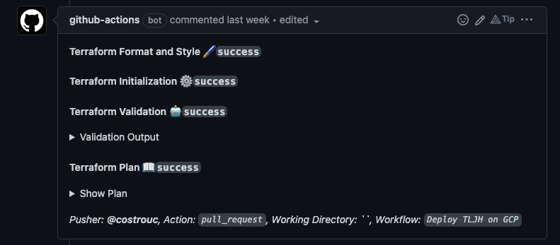

# JupyterLab User Testing Environment

Repository containing infrastructure and testing scripts for JupyterLab user testing ✨

- [JupyterLab User Testing Environment](#jupyterlab-user-testing-environment)
  - [Overview 📝](#overview-)
  - [Development and deployment 🏗](#development-and-deployment-)
    - [Pre-requisites](#pre-requisites)
    - [Deployment](#deployment)
  - [Terraform configuration 🛠](#terraform-configuration-)
    - [Requirements](#requirements)
    - [Providers](#providers)
    - [Modules](#modules)
    - [Resources](#resources)
    - [Inputs](#inputs)
    - [Outputs](#outputs)

## Overview 📝

The environment is based on [The Littlest JupyterHub (TLJH)][TLJH] which is a JupyterHub distribution for a few users (0-100).

For more information about The Littlest JupyterHub, [refer to TLJH's official documentation][TLJH].

The contents of this repository are:

```ascii
.
├── .github - GitHub Actions workflows used to deploy the environment through Terraform
├── notebooks - Notebooks used for user testing (contain the tasks or workflows to be tested)
├── .pre-commit-config.yaml - Configuration file for pre-commit hooks
├── requirements.txt - Python dependencies needed for the testing workflows
└── main.tf - Terraform configuration file
```

## Development and deployment 🏗

This section provides information on how to make changes to and deploy the user testing environment.

### Pre-requisites

To use the contents of this repository *as is* you will need to have the following tools installed:

- [Terraform](https://learn.hashicorp.com/tutorials/terraform/install-cli) >= 1.3.7

> **Note**:
> You can deploy TLJH on any public cloud provider. We have so far used GCP as our provider of choice, but TLJH in itself is vendor-agnostic.
> Refer to the [TLJH documentation for more details][TLJH] on how to deploy TLJH on other cloud providers.

Optional requirements - but needed if intending to use the repository contents as-is:

- A Google Cloud Platform user account
- A Cloudflare user account

> **Warning**:
> While the GitHub actions workflows in this repository gets credentials via OIDC (OpenID Connect) you can use a different method to get credentials.

For more information on getting GCP credentials, refer to these documentation links:

- [How to get credentials for GCP](https://registry.terraform.io/providers/hashicorp/google/latest/docs/guides/getting_started)
- [How to get credentials for Cloudflare](https://registry.terraform.io/providers/cloudflare/cloudflare/latest/docs)

### Deployment

There are three major steps to deploying the testing environment:

1. Provisioning the virtual machine (VM) on which TLJH will be installed
2. Installing TLJH on your VM
3. Adding any necessary customizations

☁️ Currently, all infrastructure is deployed via Terraform to GCP. To get more details about the resources created as well as the values for `variables.tf`, refer to the [Terraform configuration](#terraform-configuration-) section below.

The GitHub actions workflow [`.github/workflows/deploy.yaml`](.github/workflows/deploy.yaml) workflow automatically handles the provisioning, installation, and customization steps mentioned above.

- **When a new Pull Request is opened:** the `terraform plan` step is run
which checks what resources will be created/destroyed/or updated. And a comment is added to the PR with the corresponding plan.
   
- **On push/merge to `main`:** resources are applied via `terraform apply` and the cloud resources will be created/destroyed/updated accordingly.

To provision the VM (on your infrastructure) you will need to follow these steps:

1. For this repository and clone to your local machine.
2. Update the variables in [`variables.tf`](./variables.tf) to match your requirements.
3. Commit your changes and open a Pull Request against your fork of the repository.
4. This will trigger the `terraform plan` step in the GitHub Actions workflow.
5. If all seems to work correctly you can merge the Pull Request to `main`, which will trigger the provisioning step in the GitHub actions workflow.
6. Once the deployment and customization are completed, you can immediately log in to the `http://<your-domain>` with the `<admin-user-name>` specified in `variables.tf` and set an initial password.

   > **Warning:**
   > Make sure to read the [Security considerations and suggestions in the TLJH documentation](https://tljh.jupyter.org/en/latest/topic/security.html) before proceeding.
   > In brief: make sure only the GCP resources admin has `sudo` access to the VM and grant the least-privilege access to users and testers.

### Teardown

If you would like to destroy the cluster or turn it off temporarily
there is a terraform setting `enabled` which should be switched to a
value of `false`. When you would like it re-enabled simply change the
value back to true. Keep in mind that this deployment is stateless.

## Terraform configuration 🛠

### Requirements

| Name | Version |
|------|---------|
| <a name="requirement_cloudflare"></a> [Cloudflare](#requirement\_cloudflare) | ~> 3.0 |
| <a name="requirement_google"></a> [google](#requirement\_google) | 4.54.0 |

### Providers

| Name | Version |
|------|---------|
| <a name="provider_cloudflare"></a> [Cloudflare](#provider\_cloudflare) | ~> 3.0 |
| <a name="provider_google"></a> [google](#provider\_google) | 4.54.0 |

### Modules

No modules.

### Resources

| Name | Type |
|------|------|
| [cloudflare_record.main](https://registry.terraform.io/providers/cloudflare/cloudflare/latest/docs/resources/record) | resource |
| [google_compute_address.static](https://registry.terraform.io/providers/hashicorp/google/4.54.0/docs/resources/compute_address) | resource |
| [google_compute_firewall.main](https://registry.terraform.io/providers/hashicorp/google/4.54.0/docs/resources/compute_firewall) | resource |
| [google_compute_instance.main](https://registry.terraform.io/providers/hashicorp/google/4.54.0/docs/resources/compute_instance) | resource |
| [cloudflare_zone.main](https://registry.terraform.io/providers/cloudflare/cloudflare/latest/docs/data-sources/zone) | data source |

### Inputs

| Name | Description | Type | Default | Required |
|------|-------------|------|---------|:--------:|
| <a name="input_enabled"></a>[enabled](#input\ enabled) | Switch to create/remove all resources. Convenient for quickly disabling the cluster | `string` | `true` | no |
| <a name="input_admin-username"></a> [admin-username](#input\_admin-username) | Initial admin username for tljh deployment | `string` | `"costrouc"` | no |
| <a name="input_domain"></a> [domain](#input\_domain) | Domain/Zone which you have access to via cloudflare | `string` | `"quansight.dev"` | no |
| <a name="input_instance-type"></a> [instance-type](#input\_instance-type) | GCP instance to deploy TLJH | `string` | `"e2-standard-2"` | no |
| <a name="input_letsencrypt-email"></a> [letsencrypt-email](#input\_letsencrypt-email) | Email address for let's encrypt to notify renewal of certificate | `string` | `"costrouchov@quansight.com"` | no |
| <a name="input_region"></a> [region](#input\_region) | Region to deploy within | `string` | `"us-central1"` | no |
| <a name="input_subdomain"></a> [subdomain](#input\_subdomain) | Subdomain within Domain/Zone to deploy tljh | `string` | `"jupyter-a11y"` | no |
| <a name="input_zone"></a> [zone](#input\_zone) | Zone to deploy within | `string` | `"us-central1-a"` | no |

### Outputs

No outputs.

<!-- links -->
[TLJH]: https://tljh.jupyter.org/en/latest/index.html
